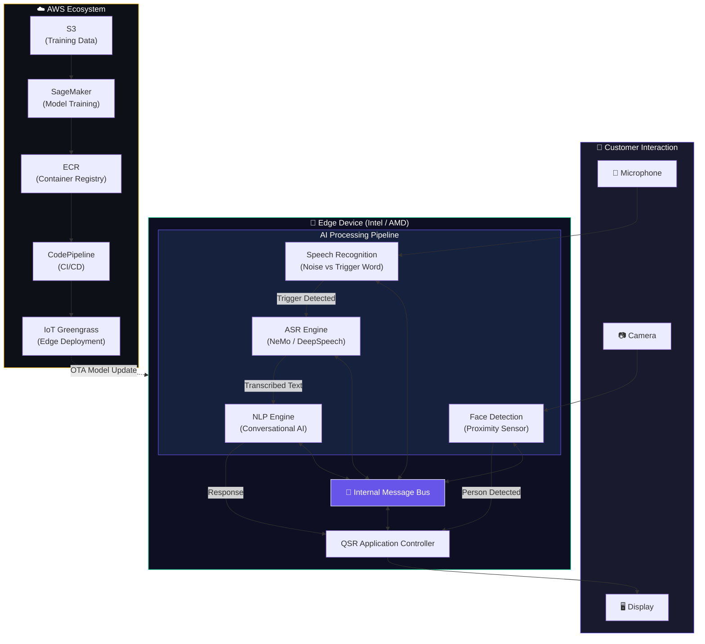
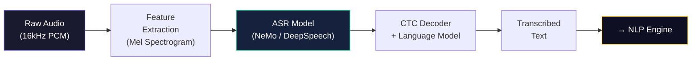
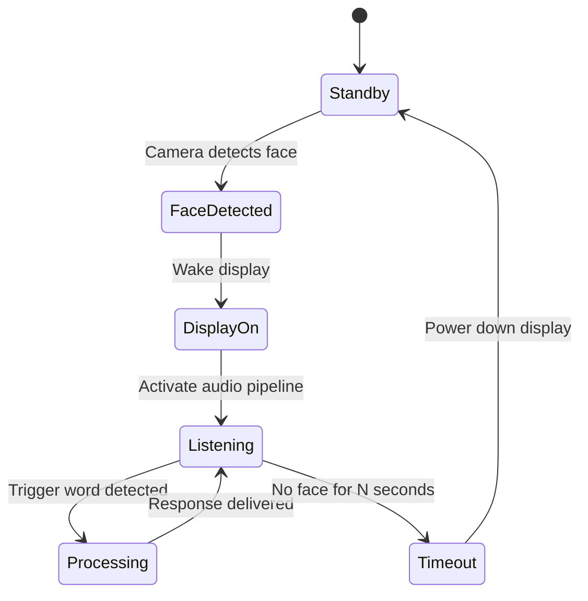
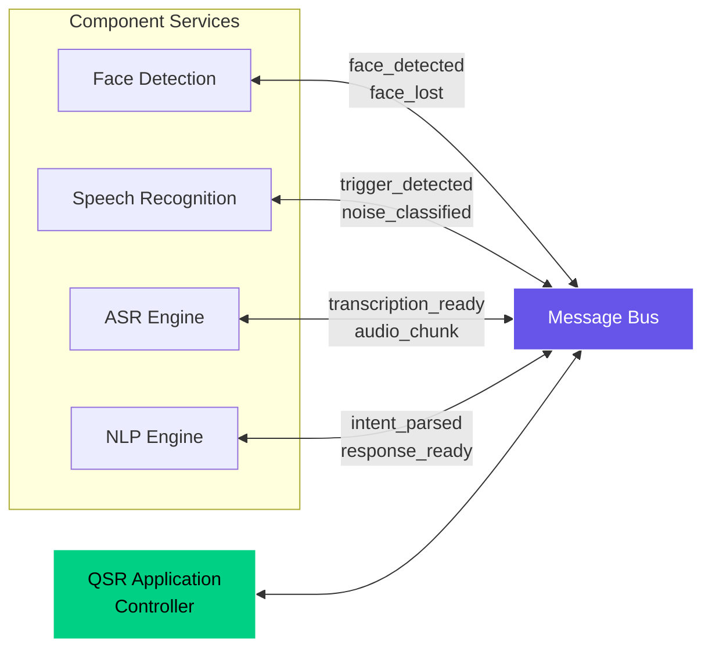
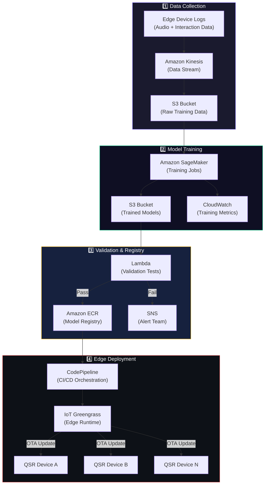
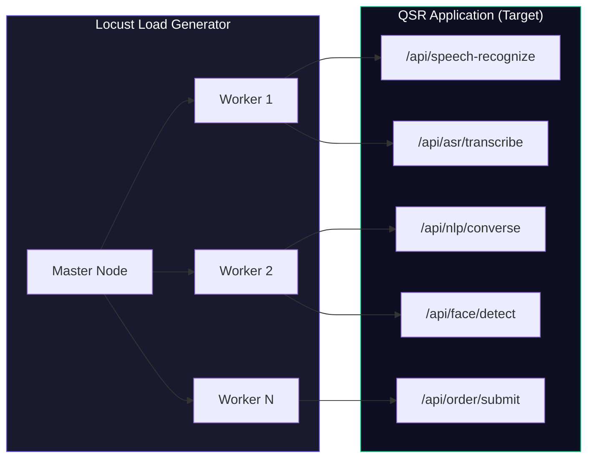

# 🧠 AI-Powered QSR — Edge Compliance & Benchmarking

> A benchmarking study of small form factor hardware devices that manage AI workloads deployed at the edge for Quick Service Restaurants (QSRs).

[](https://www.iamdave.ai/whitepaper/benchmarking-study-for-qsrs-to-implement-ai-powered-cx/)

---

## Table of Contents

- [Overview](#overview)
- [System Architecture](#system-architecture)
- [Core Components](#core-components)
  - [Speech Recognition — Noise vs Trigger Word](#1-speech-recognition--noise-vs-trigger-word)
  - [Automatic Speech Recognition (ASR)](#2-automatic-speech-recognition-asr)
  - [Natural Language Processing (NLP)](#3-natural-language-processing-nlp)
  - [Face Detection](#4-face-detection)
- [Inter-Component Communication](#inter-component-communication)
- [Edge Hardware Benchmarking](#edge-hardware-benchmarking)
  - [Intel Devices — OpenVINO](#intel-devices--openvino)
  - [AMD Devices — Vitis AI](#amd-devices--vitis-ai)
  - [Benchmark Methodology](#benchmark-methodology)
- [Automated Training & Deployment (AWS)](#automated-training--deployment-aws)
- [Load Testing (Locust)](#load-testing-locust)
- [White Paper](#white-paper)

---

## Overview

This project implements a fully integrated, AI-powered customer experience system for **Quick Service Restaurants (QSRs)**, running entirely on edge hardware. The system enables hands-free, conversational ordering through a combination of four tightly coupled AI components:

| Capability | Purpose |
|:---|:---|
| **Speech Recognition** | Distinguishes ambient noise from intentional trigger words to activate the system |
| **ASR** | Converts spoken language into text in real-time |
| **NLP** | Conversational engine that interprets user intent and drives the ordering dialogue |
| **Face Detection** | Detects customer proximity to wake the display and initiate interaction |

All components run concurrently on a single edge device and communicate through an internal message bus to deliver a seamless, low-latency ordering experience — **without reliance on cloud inference**.

---

## System Architecture



---

## Core Components

### 1. Speech Recognition — Noise vs Trigger Word

The first gate in the audio pipeline. This component continuously monitors the microphone input and classifies incoming audio frames as either **ambient noise** or a **trigger word** (e.g., "Hey Dave").

```
┌─────────────────────────────────────────────────┐
│              Audio Input Stream                  │
│                    │                             │
│         ┌─────────▼──────────┐                   │
│         │  Pre-processing    │                   │
│         │  (VAD + Noise Gate)│                   │
│         └─────────┬──────────┘                   │
│                   │                              │
│         ┌─────────▼──────────┐                   │
│         │  Trigger Word      │                   │
│         │  Classifier        │                   │
│         └────┬──────────┬────┘                   │
│              │          │                        │
│        ┌─────▼───┐ ┌────▼─────┐                  │
│        │  NOISE  │ │ TRIGGER  │──► Activate ASR  │
│        │ (Ignore)│ │ DETECTED │                  │
│        └─────────┘ └──────────┘                  │
└─────────────────────────────────────────────────┘
```

**Key Design Decisions:**
- Lightweight binary classifier optimized for edge inference
- Operates at low power draw — always listening without draining device resources
- Voice Activity Detection (VAD) as a pre-filter to reduce unnecessary classification cycles

---

### 2. Automatic Speech Recognition (ASR)

Activated only after trigger word detection. This component converts the customer's speech into text. Multiple ASR technologies were investigated and benchmarked:

| Technology | Type | Notes |
|:---|:---|:---|
| **NVIDIA NeMo** | Transformer-based (Conformer/CTC) | Best accuracy; heavier compute footprint |
| **Mozilla DeepSpeech** | RNN-based (LSTM + CTC) | Lightweight; suitable for constrained devices |

**ASR Pipeline:**



**Evaluation Criteria:**
- Word Error Rate (WER) on QSR-specific vocabulary (menu items, modifiers, quantities)
- Inference latency (P50, P95, P99) on target edge hardware
- Memory footprint and thermal throttling under sustained load

---

### 3. Natural Language Processing (NLP)

> 🔒 **Patented In-House Component**

A proprietary conversational AI engine built **before the era of LLMs**. This component interprets transcribed text, manages dialogue state, and generates contextual responses to guide the customer through the ordering flow.

**Capabilities:**
- **Intent Recognition** — Identifies user intents (e.g., `order_item`, `modify_order`, `cancel`, `confirm`)
- **Entity Extraction** — Extracts structured entities (item names, quantities, sizes, customizations)
- **Dialogue State Management** — Tracks multi-turn conversation context and order state
- **Response Generation** — Produces natural language responses and confirmations

**Conversation Flow Example:**

```
Customer: "I'd like a large combo number 3"
  → Intent:  order_item
  → Entities: {size: "large", item: "combo #3"}
  → Response: "Got it — a large combo number 3. Would you like to add a drink?"

Customer: "Yes, a medium Coke"
  → Intent:  add_item
  → Entities: {size: "medium", item: "Coke"}
  → Response: "Added a medium Coke. Anything else?"

Customer: "That's all"
  → Intent:  confirm_order
  → Response: "Your total is $8.49. Please pull forward to the window."
```

---

### 4. Face Detection

> 🔒 **In-House Face Detection Model**

A custom-trained face detection model that serves as the **proximity activation trigger** for the QSR display. When a customer approaches the kiosk or drive-through panel, the model detects their face and signals the application to:

1. **Wake the display** from standby/screensaver mode
2. **Activate the speech recognition pipeline** for interaction readiness
3. **Deactivate** once the customer moves away (no face detected for N seconds)



**Benefits:**
- Energy-efficient — display and audio pipeline only active when a customer is present
- Privacy-preserving — no facial recognition or identity tracking; purely detection-based
- Optimized for edge inference with small model footprint

---

## Inter-Component Communication

All four components operate as independent services within the QSR application and communicate through an **internal message bus** architecture:



**Event Flow:**

| Event | Producer | Consumer(s) | Action |
|:---|:---|:---|:---|
| `face_detected` | Face Detection | App Controller | Wake display, start audio pipeline |
| `trigger_detected` | Speech Recognition | ASR Engine | Begin transcription |
| `transcription_ready` | ASR Engine | NLP Engine | Parse intent & entities |
| `response_ready` | NLP Engine | App Controller | Render response on display + TTS |
| `face_lost` | Face Detection | App Controller | Timeout → standby mode |

---

## Edge Hardware Benchmarking

A critical objective of this project was evaluating whether the full AI pipeline could run on **commercial off-the-shelf (COTS) edge devices** without cloud dependency. Two hardware vendor ecosystems were benchmarked:

### Intel Devices — OpenVINO

[Intel OpenVINO](https://docs.openvino.ai/) was used to optimize and deploy models on Intel-based edge hardware.

**Optimization Pipeline:**
1. Train models in native framework (PyTorch / TensorFlow)
2. Export to ONNX intermediate representation
3. Convert to OpenVINO IR format (`.xml` + `.bin`)
4. Apply INT8 quantization via Post-Training Optimization Toolkit (POT)
5. Deploy using OpenVINO Inference Engine

**Hardware Tested:**
- Intel NUC (Core i7) with integrated GPU
- Intel Atom-based compact form factors

---

### AMD Devices — Vitis AI

[AMD Vitis AI](https://www.amd.com/en/products/software/adaptive-socs-and-fpgas/vitis/vitis-ai.html) was used as the optimization framework for AMD edge hardware.

**Optimization Pipeline:**
1. Train models in native framework
2. Quantize models using Vitis AI Quantizer
3. Compile for target DPU (Deep Processing Unit) architecture
4. Deploy via Vitis AI Runtime

**Hardware Tested:**
- AMD embedded edge devices with integrated AI acceleration

---

### Benchmark Methodology

| Metric | Description |
|:---|:---|
| **Inference Latency** | End-to-end time from input to prediction (P50 / P95 / P99) |
| **Throughput** | Inferences per second under sustained load |
| **Power Consumption** | Watts drawn during active inference |
| **Thermal Performance** | Temperature stability under continuous operation |
| **Model Accuracy** | Post-quantization accuracy vs baseline (FP32) |
| **Memory Footprint** | Peak RAM/VRAM usage per component |

> 📄 **For detailed benchmark results, methodology, and hardware specifications, refer to the** [**organization white paper**](https://www.iamdave.ai/whitepaper/benchmarking-study-for-qsrs-to-implement-ai-powered-cx/).

---

## Automated Training & Deployment (AWS)

The full model lifecycle — from data collection to edge deployment — is automated through an AWS-based CI/CD pipeline:



**Pipeline Stages:**

| Stage | AWS Service(s) | Purpose |
|:---|:---|:---|
| **Data Ingestion** | Kinesis → S3 | Stream interaction logs from edge devices for retraining |
| **Model Training** | SageMaker | Run training jobs with versioned datasets |
| **Model Validation** | Lambda + Step Functions | Automated accuracy/performance gating |
| **Model Registry** | ECR / S3 | Store validated, deployment-ready model artifacts |
| **CI/CD Orchestration** | CodePipeline + CodeBuild | Build containers, run integration tests |
| **Edge Deployment** | IoT Greengrass | Push OTA (over-the-air) model updates to fleet of QSR devices |
| **Monitoring** | CloudWatch + SNS | Track model drift, device health, and alert on failures |

---

## Load Testing (Locust)

End-to-end load testing was designed using [**Locust**](https://locust.io/) — a Python-based, distributed load testing framework — to validate the QSR application under realistic and peak traffic conditions.

### Test Architecture



### Test Scenarios

| Scenario | Description | Simulated Users |
|:---|:---|:---|
| **Single Conversation** | One customer completing a full order flow | 1 |
| **Peak Hour** | Multiple concurrent customers across multiple kiosks | 10–50 |
| **Sustained Load** | Continuous ordering over extended periods (4+ hours) | 5–20 |
| **Spike Test** | Sudden traffic surge (e.g., lunch rush) | 1 → 100 ramp |
| **Component Isolation** | Stress-test individual components (ASR-only, NLP-only) | Varies |

### Metrics Collected

- **Response Time** — Per-endpoint latency distribution (min, median, P95, P99, max)
- **Throughput** — Requests per second across the full pipeline
- **Error Rate** — Failed requests / timeouts under load
- **Resource Utilization** — CPU, memory, GPU usage on edge device during test
- **End-to-End Latency** — Time from audio input to display response

---

## White Paper

For detailed benchmark results, hardware specifications, and the complete study:

📄 **[Benchmarking Study for QSRs to Implement AI-Powered CX](https://www.iamdave.ai/whitepaper/benchmarking-study-for-qsrs-to-implement-ai-powered-cx/)**

---

<p align="center">
  <sub>⚠️ This repository contains documentation only. Source code is proprietary and not included.</sub>
</p>
